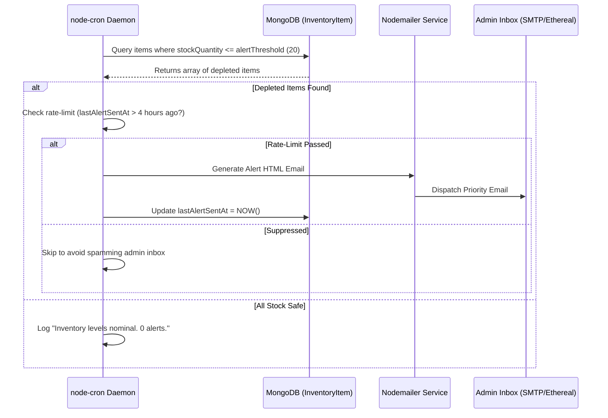

# Inventory Automation & Scheduled Job Specification

## Project: Crust & Craft — Automated Stock Intelligence Engine
**Track:** Oasis Infobyte SIP — Level 3 Web Development  

---

## 1. Requirement Scope & Engineering Objective

The Oasis Infobyte specification mandates three core inventory automation capabilities:
1. **Atomic Stock Decrement:** Upon successful order confirmation, the system must immediately and atomically decrement every ingredient used (crust, sauce, cheese, toppings).
2. **Manual Admin Stock Controls:** Store managers must have dynamic real-time controls to adjust counts or trigger bulk restocks.
3. **Automated Scheduled Alert Worker (`node-cron`):** A background daemon that inspects stock thresholds and automatically fires emergency warning emails via Nodemailer when any stock drops below threshold (default: <= 20 units).

---

## 2. Concurrency Safety: Atomic Decrement Engine

When multiple customers order simultaneously during peak hours, naive read-modify-write patterns (`item.stockQuantity -= 1; await item.save()`) cause **race conditions and phantom stock**.

### 2.1 The Atomic `$inc` Pattern
To guarantee consistency without requiring heavy multi-document distributed locks, we execute atomic MongoDB `$inc` operations with a boundary check:

```javascript
// services/inventoryService.js
async function decrementIngredients(orderItems) {
  const operations = [];

  for (const item of orderItems) {
    const qty = item.quantity || 1;

    // 1. Decrement Base
    operations.push({
      updateOne: {
        filter: { name: item.base, category: 'base', stockQuantity: { $gte: qty } },
        update: { $inc: { stockQuantity: -qty } }
      }
    });

    // 2. Decrement Sauce
    operations.push({
      updateOne: {
        filter: { name: item.sauce, category: 'sauce', stockQuantity: { $gte: qty } },
        update: { $inc: { stockQuantity: -qty } }
      }
    });

    // 3. Decrement Cheese
    operations.push({
      updateOne: {
        filter: { name: item.cheese, category: 'cheese', stockQuantity: { $gte: qty } },
        update: { $inc: { stockQuantity: -qty } }
      }
    });

    // 4. Decrement Selected Veggies
    if (Array.isArray(item.veggies)) {
      for (const veggie of item.veggies) {
        operations.push({
          updateOne: {
            filter: { name: veggie, category: 'veggie', stockQuantity: { $gte: qty } },
            update: { $inc: { stockQuantity: -qty } }
          }
        });
      }
    }
  }

  // Execute in single bulk write
  const result = await InventoryItem.bulkWrite(operations);
  return result;
}
```

---

## 3. Scheduled Worker Architecture (`node-cron`)

### 3.1 Job Frequency & Schedule
* **Cron Expression:** `*/10 * * * *` (Runs every 10 minutes continuously in background).
* **On-Demand Hook:** Also runs synchronously right after any high-volume order decrement.

### 3.2 Audit & Alert Workflow



### 3.3 Email Notification Template
The email generated by `emailService.js` includes a high-contrast tabular report:
* **Subject:** `⚠️ CRITICAL: Low Stock Warning for Crust & Craft Kitchen`
* **Content:**
  - Item Name & Category
  - Remaining Units vs. Configured Threshold
  - Timestamp of alert
  - One-click direct link to Admin Restock Dashboard: `http://localhost:5000/admin/inventory`

---

## 4. Admin Stock Controls & Manual Replenishment

From the Admin Dashboard:
* **One-Click Quick Restock Buttons:**
  - `+20 Restock`
  - `+50 Restock`
  - Custom Numeric Input
* **Threshold Customization:**
  - Admins can adjust the threshold per item (e.g. increase base threshold to 30 before busy weekends).
* **Depletion Badges:**
  - `Safe (Green)`: `stock > threshold`
  - `Low Stock (Yellow)`: `0 < stock <= threshold`
  - `Out of Stock (Red)`: `stock === 0` (Automatically disables item in Custom Pizza Builder).
