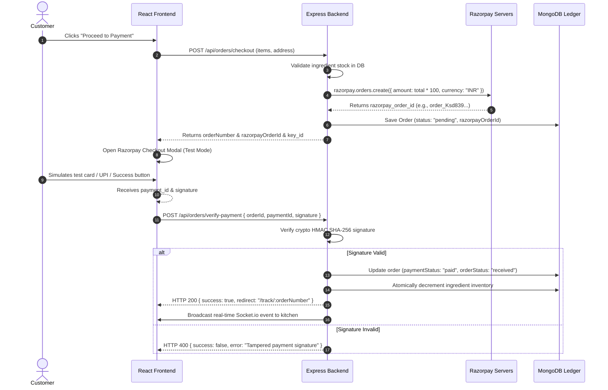

# Payment Gateway Integration Specification: Razorpay Test Mode

## Project: Crust & Craft — Transactional Payment Architecture
**Gateway:** Razorpay (Test Environment)  
**Security:** HMAC SHA-256 Cryptographic Signature Verification  

---

## 1. End-to-End Payment Flow Architecture



---

## 2. Server-Side Razorpay Order Creation

```javascript
// controllers/orderController.js
import Razorpay from 'razorpay';

const razorpay = new Razorpay({
  key_id: process.env.RAZORPAY_KEY_ID || 'rzp_test_placeholder',
  key_secret: process.env.RAZORPAY_KEY_SECRET || 'secret_placeholder'
});

export const createCheckoutOrder = async (req, res) => {
  const { items, deliveryAddress, customerPhone } = req.body;
  
  // 1. Calculate price securely on server (never trust client total)
  const calculatedTotal = await calculateServerSideTotal(items);

  // 2. Create Razorpay order (amount in smallest currency unit: paise/cents)
  const options = {
    amount: Math.round(calculatedTotal * 100),
    currency: "INR",
    receipt: `receipt_${Date.now()}`
  };

  const razorpayOrder = await razorpay.orders.create(options);

  // 3. Persist pending order in DB
  const newOrder = await Order.create({
    orderNumber: `CC-${Math.floor(10000 + Math.random() * 90000)}`,
    customer: req.user._id,
    customerDetails: {
      name: req.user.name,
      email: req.user.email,
      phone: customerPhone,
      deliveryAddress
    },
    items,
    totalAmount: calculatedTotal,
    payment: {
      gateway: 'razorpay',
      razorpayOrderId: razorpayOrder.id,
      status: 'pending'
    }
  });

  res.status(201).json({
    success: true,
    data: {
      orderId: newOrder._id,
      orderNumber: newOrder.orderNumber,
      amount: razorpayOrder.amount,
      currency: razorpayOrder.currency,
      razorpayOrderId: razorpayOrder.id,
      razorpayKeyId: process.env.RAZORPAY_KEY_ID
    }
  });
};
```

---

## 3. Cryptographic Signature Verification

Tamper-proofing is enforced using Node.js native `crypto`:

```javascript
// controllers/orderController.js
import crypto from 'crypto';

export const verifyPayment = async (req, res) => {
  const { orderId, razorpayOrderId, razorpayPaymentId, razorpaySignature } = req.body;

  // Expected signature: HMAC-SHA256(orderId + "|" + paymentId, secret)
  const hmac = crypto.createHmac('sha256', process.env.RAZORPAY_KEY_SECRET);
  hmac.update(`${razorpayOrderId}|${razorpayPaymentId}`);
  const expectedSignature = hmac.digest('hex');

  const isValid = expectedSignature === razorpaySignature;

  // Support local test simulation bypass if keys are running in simulated demo mode
  const isSimulation = process.env.NODE_ENV === 'development' && razorpaySignature === 'simulated_test_sig';

  if (!isValid && !isSimulation) {
    return res.status(400).json({ success: false, message: 'Invalid payment signature. Potential tampering.' });
  }

  // Update order status to paid
  const order = await Order.findById(orderId);
  order.payment.status = 'paid';
  order.payment.razorpayPaymentId = razorpayPaymentId;
  order.payment.paidAt = new Date();
  order.orderStatus = 'received';
  await order.save();

  // Atomically decrement inventory
  await decrementIngredients(order.items);

  // Broadcast WebSocket notification to kitchen
  io.emit('admin:new_order', { orderId: order._id, orderNumber: order.orderNumber });

  res.status(200).json({
    success: true,
    message: 'Payment verified and order confirmed.',
    orderNumber: order.orderNumber
  });
};
```

---

## 4. Client-Side Modal Trigger (`checkout.jsx`)

The frontend loads the official Razorpay script asynchronously:
```javascript
const loadRazorpayScript = () => {
  return new Promise((resolve) => {
    if (window.Razorpay) return resolve(true);
    const script = document.createElement('script');
    script.src = 'https://checkout.razorpay.com/v1/checkout.js';
    script.onload = () => resolve(true);
    script.onerror = () => resolve(false);
    document.body.appendChild(script);
  });
};
```

When checkout is confirmed, Razorpay's modal renders with testing helpers:
* Test Cards: `4111 1111 1111 1111`, any future expiry, CVV `123`.
* OTP: Clicking "Success" automatically simulates test fulfillment.
