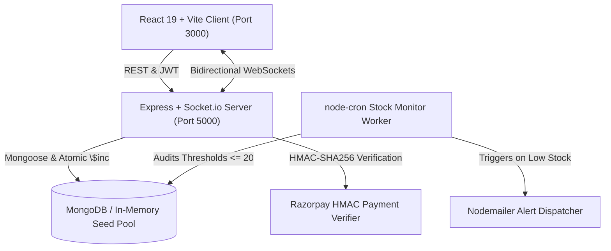

# Crust & Craft — Artisanal Pizza Delivery & Automated Inventory System
> **Oasis Infobyte Student Internship Program (OIB-SIP)**  
> **Track:** Web Development & Designing — Level 3 (Production Tier)  
> **Author:** Natnael Tezazu ([@Natnael-Dev](https://github.com/Natnael-Dev))  
> **Batch:** August – September 2026  
> **Repository:** `OIBSIP`  

[](LICENSE)
[](https://nodejs.org/)
[](https://react.dev/)
[](https://vitejs.dev/)
[](https://tailwindcss.com/)
[](https://www.mongodb.com/)
[](https://socket.io/)
[](WebDev-L3-PizzaDelivery/server/tests)

---

## 🍕 Overview

**Crust & Craft** is a full-stack artisanal pizza delivery and automated kitchen inventory platform engineered for the Oasis Infobyte Student Internship Program (SIP). 

Built without AI boilerplate or generic templates, Crust & Craft pairs high-contrast cinema aesthetics and fluid micro-interactions with an enterprise backend featuring atomic stock management, automated `node-cron` threshold monitors, WebSocket order tracking, and cryptographic payment verification.



---

## ✨ Flagship Capabilities

- **Interactive 4-Step Pizza Builder**: Real-time layer composition supporting 5 custom bases, 5 sauces, premium cheeses, and multi-selection farm-fresh vegetables.
- **Atomic Stock Decrement**: Concurrency-safe MongoDB `$inc` operations decrement ingredient counts upon verified payment completion, preventing overselling.
- **Automated Inventory Audit & Cooldown**: Background `node-cron` worker monitors stock thresholds and dispatches emergency HTML alert emails with a 4-hour duplicate suppression window.
- **Bi-Directional Order Stepper**: Live Socket.io pipeline updates customer delivery stages (`Received` ➔ `In Oven` ➔ `Out for Delivery` ➔ `Delivered`) as kitchen dispatchers advance statuses.
- **Cryptographic Payment Gateway**: Simulated Razorpay modal with server-side HMAC-SHA256 signature verification.
- **Zero-Config Developer Experience**: Automated in-memory MongoDB fallback pre-seeds catalog pizzas and 21 ingredients out-of-the-box when running without a local MongoDB service.

---

## 🔑 Pre-Seeded Demo Credentials

Both customer and administrative portals feature **1-Click Demo Fill** buttons for effortless evaluation:

| Portal | Role | Email | Password | Access Route |
| :--- | :--- | :--- | :--- | :--- |
| **Customer Portal** | Customer | `customer@crustcraft.com` | `Customer123!` | Nav Bar ➔ `Sign In` / Checkout |
| **Kitchen Cockpit** | Admin | `admin@crustcraft.com` | `AdminSecret2026!` | Header Shield ➔ `/admin/login` |

---

## 🚀 Quick Start (Local Setup)

### Prerequisites
- Node.js v20+
- npm v10+

### One-Command Boot
```bash
# 1. Clone the repository
git clone https://github.com/Natnael-Dev/OIBSIP.git
cd OIBSIP

# 2. Install all dependencies (Monorepo root, Client, Server)
npm install
npm --prefix WebDev-L3-PizzaDelivery/client install
npm --prefix WebDev-L3-PizzaDelivery/server install

# 3. Launch both Frontend and Backend concurrently
npm run dev:all
```

- **Frontend Application**: `http://localhost:3000`
- **Backend API Gateway**: `http://localhost:5000`
- **Admin Cockpit**: `http://localhost:3000/admin/login`

---

## 🧪 Test Suite & Verification

The backend includes a comprehensive 21-test integration suite covering authentication, RBAC, atomic stock bounds, order lifecycles, and cron alert dispatch:

```bash
# Run backend test suite
npm test

# Run frontend production build
npm run build
```

---

## 📚 Technical Documentation

All detailed specifications, architecture diagrams, and rubrics have been organized into the **[`docs/`](docs/)** directory:

- **[Master Documentation Index](docs/README.md)**
- **[System Architecture & C4 Dataflow](docs/architecture.md)**
- **[Product Requirements Document (PRD)](docs/PRD.md)**
- **[REST & WebSocket API Specifications](docs/API_SPECIFICATION.md)**
- **[MongoDB Data Dictionary & Schema](docs/DATA_DICTIONARY.md)**
- **[Inventory Automation & Cron Specifications](docs/INVENTORY_AUTOMATION_SPEC.md)**
- **[Razorpay Payment Integration Guide](docs/PAYMENT_GATEWAY_INTEGRATION.md)**
- **[Security & RBAC Specification](docs/SECURITY_AND_RBAC_SPECIFICATION.md)**
- **[Anti-AI-Slop Design Manifesto](docs/ANTI_SLOP_AND_DESIGN_MANIFESTO.md)**
- **[Figma Prompts & UI Tokens](docs/FIGMA_PROMPTS_AND_UI_SPEC.md)**
- **[E2E Verification & Demo Script](docs/E2E_VERIFICATION_AND_DEMO_SCRIPT.md)**

---

## 📂 Repository Layout

```
OIBSIP/
├── docs/                               <-- Master specifications, PRD, architecture, and API docs
│   ├── README.md                       <-- Documentation index & Table of Contents
│   ├── architecture.md
│   ├── PRD.md
│   ├── API_SPECIFICATION.md
│   ├── DATA_DICTIONARY.md
│   └── ...
│
├── WebDev-L3-PizzaDelivery/             <-- Oasis Infobyte Level 3 Project Root
│   ├── client/                         <-- React 19, Vite, TailwindCSS, Framer Motion
│   │   ├── public/assets/              <-- Video hero and SVG ingredient assets
│   │   ├── src/components/             <-- PizzaBuilder, CartDrawer, TrackingPage, AdminCockpit
│   │   └── package.json
│   │
│   ├── server/                         <-- Node.js Express, MongoDB, Socket.io, node-cron
│   │   ├── controllers/                <-- Auth, Inventory, Order, Pizza controllers
│   │   ├── models/                     <-- User, InventoryItem, Order, Pizza schemas
│   │   ├── routes/                     <-- Express router modules
│   │   ├── services/                   <-- Cron, Nodemailer, and Socket.io services
│   │   ├── tests/                      <-- 21 integration tests
│   │   └── server.js
│   │
│   └── README.md                       <-- Level 3 project summary
│
├── LICENSE                             <-- MIT Open-Source License
├── CONTRIBUTING.md                     <-- Contribution guidelines
└── README.md                           <-- Monorepo showcase overview
```

---

## 📄 License & Attribution

This project is licensed under the [MIT License](LICENSE).  
Created as part of the **Oasis Infobyte Student Internship Program** (Domain: Web Development & Designing).
