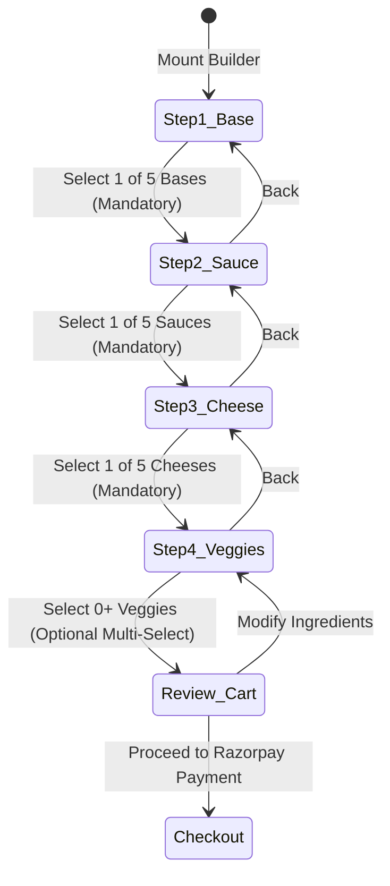
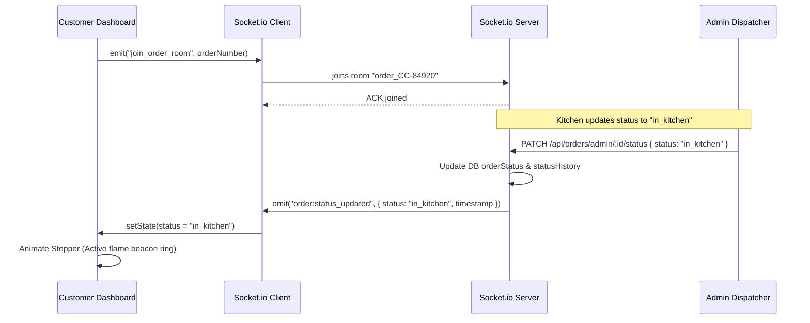

# State Management & Dynamic Flow Architecture

## Scope: Client & Server State Synchronization
**Application:** Crust & Craft (Level 3 Pizza Delivery Engine)  

---

## 1. 4-Step Custom Pizza Builder State Machine

The Custom Pizza Builder is modeled as a deterministic finite-state machine (FSM) ensuring users cannot proceed to checkout with an incomplete recipe.



### 1.1 Builder State Schema (`usePizzaBuilder`)
```typescript
interface CustomPizzaState {
  currentStep: 1 | 2 | 3 | 4;
  selectedBase: {
    id: string;
    name: string;
    price: number;
    calories: number;
  } | null;
  selectedSauce: {
    id: string;
    name: string;
    price: number;
    spiciness: number;
  } | null;
  selectedCheese: {
    id: string;
    name: string;
    price: number;
  } | null;
  selectedVeggies: Array<{
    id: string;
    name: string;
    price: number;
  }>;
  quantity: number;
  calculatedPrice: number;
  isStepValid: boolean;
}
```

### 1.2 Dynamic Pricing Engine Formula
```javascript
const calculateDynamicPrice = (state) => {
  const baseMargin = 10.00; // standard chef preparation margin
  const crustCost = state.selectedBase?.price || 0;
  const sauceCost = state.selectedSauce?.price || 0;
  const cheeseCost = state.selectedCheese?.price || 0;
  const veggiesCost = state.selectedVeggies.reduce((sum, v) => sum + v.price, 0);

  const unitTotal = baseMargin + crustCost + sauceCost + cheeseCost + veggiesCost;
  return Math.round(unitTotal * 100) / 100;
};
```

---

## 2. Global Cart & Checkout Context (`CartContext`)

```typescript
interface CartItem {
  id: string; // generated UUID
  itemType: 'preset' | 'custom';
  name: string;
  base: string;
  sauce: string;
  cheese: string;
  veggies: string[];
  quantity: number;
  unitPrice: number;
  totalPrice: number;
}

interface CartContextValue {
  cart: CartItem[];
  subtotal: number;
  tax: number; // 8% of subtotal
  deliveryFee: number; // $3.50 flat
  grandTotal: number;
  addItem: (item: CartItem) => void;
  removeItem: (itemId: string) => void;
  updateQuantity: (itemId: string, quantity: number) => void;
  clearCart: () => void;
}
```

---

## 3. Real-Time Order Tracking State Lifecycle (`SocketContext`)

When an order is confirmed, the client mounts the live tracking timeline:



### Status Step Progression Enum
1. `received`: "Order Confirmed & Payment Captured" (Green checkmark)
2. `in_kitchen`: "Baking in Wood-Fired Oven" (Pulsing amber flame)
3. `sent_to_delivery`: "Dispatched with Driver" (Animated scooter indicator)
4. `delivered`: "Delivered Fresh & Hot" (Celebration confetti state)
