# Crust & Craft — Technical Documentation Index

Welcome to the technical documentation repository for **Crust & Craft** (Oasis Infobyte Internship — Web Development & Design Level 3).

This directory organizes all architecture plans, formal specifications, design manifestos, and operational runbooks for the system.

---

## 📑 Documentation Map

```mermaid
graph TD
    A[Crust & Craft Docs] --> B[Architecture & Engineering]
    A --> C[Product & Data Specifications]
    A --> D[Design System & UI Specs]
    A --> E[Integrations & Real-Time]
    A --> F[Verification & Rubric Compliance]

    B --> B1[architecture.md]
    B --> B2[CODEBASE_STRUCTURE_AND_ENGINEERING_STANDARDS.md]
    B --> B3[STATE_MANAGEMENT_AND_FLOW_ARCHITECTURE.md]
    B --> B4[INVENTORY_AUTOMATION_SPEC.md]

    C --> C1[PRD.md]
    C --> C2[DATA_DICTIONARY.md]
    C --> C3[API_SPECIFICATION.md]
    C --> C4[SECURITY_AND_RBAC_SPECIFICATION.md]

    D --> D1[ANTI_SLOP_AND_DESIGN_MANIFESTO.md]
    D --> D2[FIGMA_PROMPTS_AND_UI_SPEC.md]
    D --> D3[COMPETITIVE_ANALYSIS_AND_OPEN_SOURCE_BENCHMARKS.md]

    E --> E1[PAYMENT_GATEWAY_INTEGRATION.md]
    E --> E2[agent.md]

    F --> F1[E2E_VERIFICATION_AND_DEMO_SCRIPT.md]
    F --> F2[FORENSIC_DOCS_AUDIT.md]
    F --> F3[GIT_COMMIT_TIMELINE.md]
    F --> F4[everything-you-want-to-rule.md]
```

---

## 1. System Architecture & Standards

- **[System Architecture](architecture.md)**  
  High-level C4 diagram, system topology, microservice-ready modular monolith, and dataflow pathways.
- **[Codebase Structure & Engineering Standards](CODEBASE_STRUCTURE_AND_ENGINEERING_STANDARDS.md)**  
  Monorepo layout, file naming conventions, ESLint/Prettier configuration, and test requirements.
- **[State Management & Flow Architecture](STATE_MANAGEMENT_AND_FLOW_ARCHITECTURE.md)**  
  Client-side React context architecture (`AuthContext`, `CartContext`), optimistic UI updates, and WebSocket synchronization.
- **[Inventory Automation Specification](INVENTORY_AUTOMATION_SPEC.md)**  
  Autonomous stock monitoring engine, `node-cron` background daemon, low-stock alerting logic, and cooldown window.

---

## 2. Product Requirements & Data Modeling

- **[Product Requirements Document (PRD)](PRD.md)**  
  Complete domain requirements, feature matrix, personas, user stories, and acceptance criteria.
- **[Data Dictionary](DATA_DICTIONARY.md)**  
  Mongoose schemas (`User`, `InventoryItem`, `Order`, `Pizza`), indexing strategy, and atomic update constraints.
- **[REST API Specification](API_SPECIFICATION.md)**  
  Complete contract for all `/api/auth`, `/api/inventory`, `/api/orders`, and `/api/pizzas` endpoints.
- **[Security & RBAC Specification](SECURITY_AND_RBAC_SPECIFICATION.md)**  
  Authentication lifecycle, JWT signed payloads, bcrypt password hashing, and role isolation (`customer` vs `admin`).

---

## 3. UI/UX & Design Systems

- **[Anti-AI-Slop & Design Manifesto](ANTI_SLOP_AND_DESIGN_MANIFESTO.md)**  
  Design guidelines rejecting generic AI boilerplate: typography, motion physics, tactile feedback, and dark mode palette.
- **[Figma Prompts & UI Specification](FIGMA_PROMPTS_AND_UI_SPEC.md)**  
  Component-level prompt suite, micro-interactions, layout coordinates, and responsive breakpoints.
- **[Competitive Analysis & Benchmarks](COMPETITIVE_ANALYSIS_AND_OPEN_SOURCE_BENCHMARKS.md)**  
  Comparison against Domino's, Pizza Hut, and artisanal e-commerce experiences.

---

## 4. Integrations & Real-Time Engines

- **[Payment Gateway Integration Guide](PAYMENT_GATEWAY_INTEGRATION.md)**  
  Razorpay SDK setup, test-mode payment flow, HMAC-SHA256 signature verification, and atomic post-payment stock decrement.
- **[Autonomous Engineering System (Agent Directive)](agent.md)**  
  Phase gates, operational constraints, and verification protocols for agentic development.

---

## 5. Verification, Audits & Deliverables

- **[E2E Verification & Demo Script](E2E_VERIFICATION_AND_DEMO_SCRIPT.md)**  
  Step-by-step verification script for recording the 2-second title card and demo video.
- **[Forensic Documentation Audit](FORENSIC_DOCS_AUDIT.md)**  
  Comprehensive consistency audit aligning PRD, schemas, API endpoints, and client routes.
- **[Git Commit Timeline](GIT_COMMIT_TIMELINE.md)**  
  Atomic contribution roadmap and conventional commit ledger.
- **[Internship Guidelines & Master Rules](everything-you-want-to-rule.md)**  
  Submission rules, folder naming convention, and evaluator guidelines.
